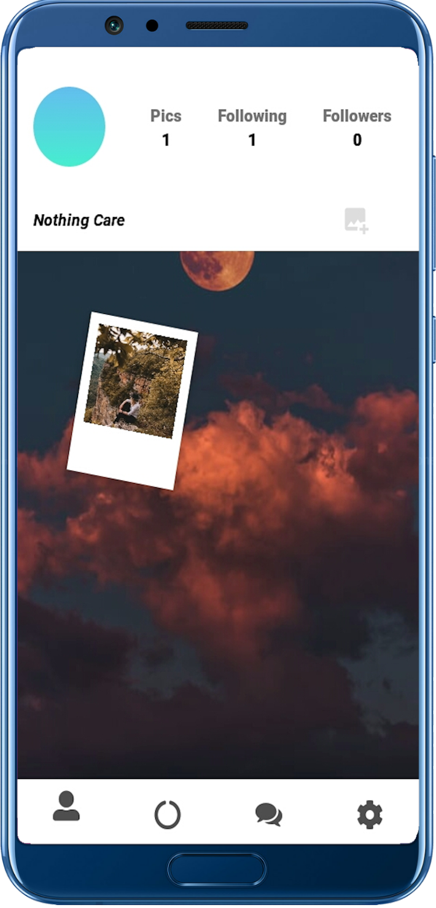
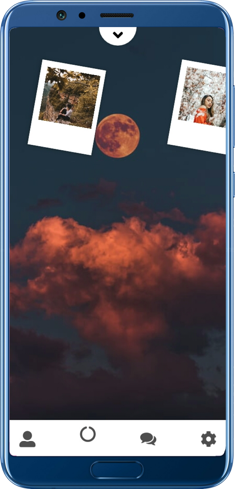
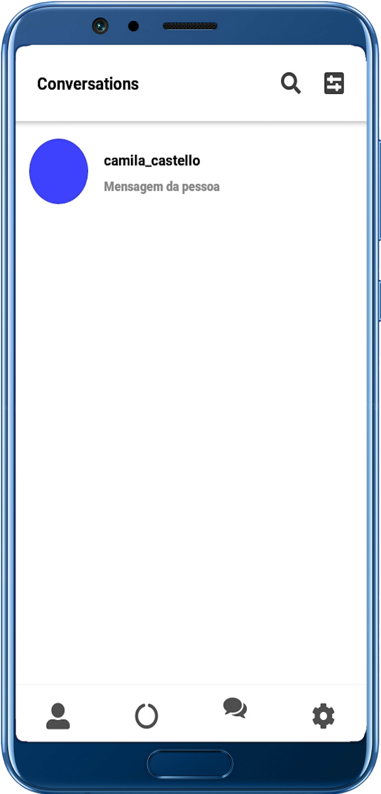

<div align="center">

# Triptych






</div>

## Descrição

Este projeto foi indealizado por dois estudantes, incluindo eu. No início este projeto foi pensado em uma "rede social" que 
deixa disponível para que o usuário possa postar suas fotos, mas não da mesma forma como conhecemos... Mas sim em formato de polaroid, para que se torne como um mural que pode ser alterado e customizado de forma única por cada usuário, tendo assim o toque de cada usuário por aquilo que mais gosta ou deseja.

## **Tecnologias utilizadas**

  - [Node.js](https://nodejs.org/en/)
  - [React Native](https://reactnative.dev/)
  - [Expo](https://expo.io/learn)

  A tecnologia principal usada foi o react native, porém não foi usado o react-native-cli, mas sim com o expo para criar a aplicação react native.

## **Como instalar**

  É válido ressaltar que, para que você consiga instalar, modificar e visualizar o projeto na sua máquina, você deverá ter instalado:

  - Git ( Somente se você optar em fazer o download do repositório via [Git-Scm](https://git-scm.com/) )
  - Node.js
  - Expo

  > ### **Download via Browser**

  Para fazer o download do repositório via browser, clicar no botão verde com o nome **Clone or Download** no inicio da página, ao lado direito.

  > ### **Download via Git**

  Para fazer o download via git, você deverá rodar o seguinte comando no terminal/prompt de comando:

  ```
  git clone https://github.com/luan4g/Triptych.git
  ```
  > ### **Instalando o Projeto**

  Para instalar o projeto em seu computador, você deverá instalar todas as dependências usadas durante todo o projeto, mas antes você deverá instalar o cliente da expo, pois senão você não ira conseguir ver as modificações feitas por você. Para instalar o cliente da Expo você pode olhar todo o guia no site da [Expo](https://expo.io/learn), ou rodar o seguinte comando:

  ```
    npm install expo-cli --global
  ```

  Se você se interessar em olhar quais dependências foram utilizadas, abrir o arquivo:

  **_package.json_**.

  Para instalar eles automáticamente, para não precisar ir de um em um, você deverá ter instalado em sua máquina o npm ou o yarnpgk.

  ### **Usando o npm**

  ```
  npm install

  npm start
  ```

  ### **Usando o yarnpgk**

  ```
  yarn

  yarn start
  ```

  Ao usar o comando o `npm start` ou `yarn start` o projeto já irá executar e rodar no cliente da expo, podendo assim já visualizar pelo aplicativo da expo, disponível na _Play Store_ ou na _Apple Store_.